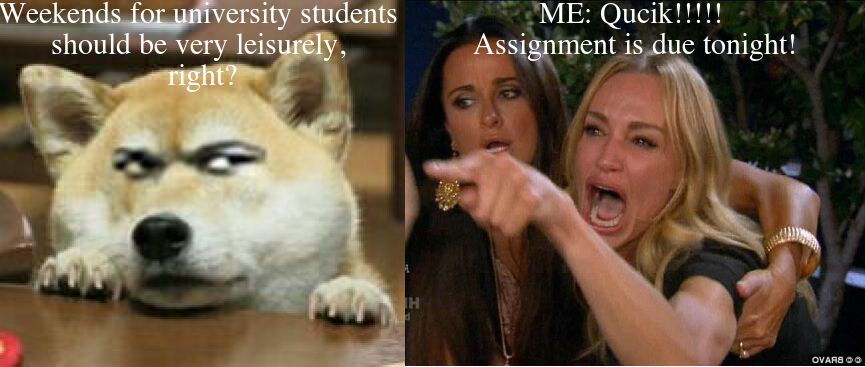

# Hello guys!
Welcome to my GitHub. 
Here, I will display my meme.

## About me
I'm currently a UoA students, major in data science. This is my first time using the GitHub platform. 
## About meme 
This meme was inspired by the fact that I have numerous assignments due on the same day. I have to work on the assignments during the weekends in order to submit all the assignments on time.


## Tools that I use to make a meme:
 ### Tools Used
1. The **R** programming language 
2. The *magick* R package ([magick package link](https://cran.r-project.org/web/packages/magick/vignettes/intro.html))

## Code
```r
library(magick)
woman_yelling <- image_read("https://i.kym-cdn.com/photos/images/newsfeed/001/505/717/49b.jpg") %>%
  image_scale(460) 
woman_flip <- image_flop(woman_yelling)

cat_image <- image_read("http://www.youqu5.net/d/file/2018-12-27/a94c57566d3e02cf59640368ab39e58f.jpg") %>%
  image_scale(405)


cat_text <- image_annotate(cat_image, "Weekends for university students \nshould be very leisurely, \nright?", font = 'Times', size = 30, color = "white", gravity = "north")

woman_text <- image_annotate(woman_flip, "ME: Qucik!!!!! \nAssignment is due tonight!", font = 'Times', size = 30, color = "white", gravity = "north")

meme <- c(cat_text, woman_text) %>% image_append()
meme
image_write(meme, "my_meme.png")

```
